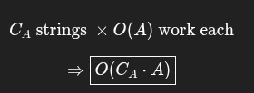

# Generate All Combinations of Well-Formed Parentheses

## Problem Statement
Given an integer A representing pairs of parentheses, write a function to generate all combinations of well-formed parentheses of length 2*A.

## Input
Integer A (number of pairs)

## Output
All valid combinations of well-formed parentheses

## Example
**Input**: 2
**Output**:
```
()()
(())
```

**Input**: 3
**Output**:
```
()()()
()(())
(())()
(())()
((()))
``` 

## Approach 

- here we have to generate all possibilties of parenthesis
- at every step we have two element of choice either  to keep ( or )
- but also a valid parenthesis
- so if closing bracket is more than openning bracket then it is wrong.
- and if the opening bracket is more than A then wrong .
- then we will generate possiblities with valid parenthesis.

## note

```
helper(ans, curr, openBrac++, closingBrac, A, index++);
```

- here we passing the old value to the method ++ increment after that line
- so the recusion will get same value the value will increment locally

```
if (closingBrac <= openBrac)
```

- This allows ")" even when counts are equal — leading to invalid sequences.
- because we are always incrementing the count for the next call.

## complexity 

- Time_complexity: O(Ca * A)
- 

- 